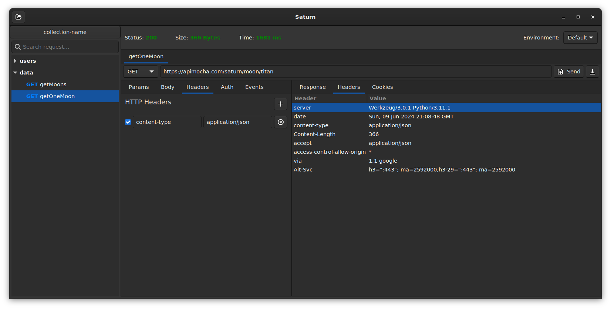
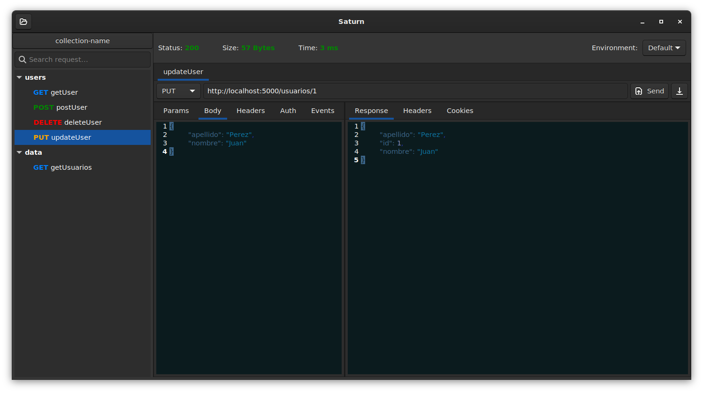

# Saturn

Saturn is a lightweight and native REST client application designed for Linux environments. Built using PyGTK with Gtk3, it offers a simple and user-friendly interface, emphasizing minimal resource consumption compared to other clients available on the internet.

## Features
- **Lightweight:** Saturn is optimized for minimal resource usage, ensuring smooth performance even on low-end systems.
- **Native:** Developed specifically for Linux environments, Saturn seamlessly integrates with the system, providing a cohesive user experience.
- **User-Friendly Interface:** With a clean and intuitive interface, Saturn makes it easy for users to interact with REST APIs without unnecessary complexity.
- **PyGTK with Gtk3:** Leveraging the power of PyGTK with Gtk3, Saturn delivers a responsive and efficient application framework.
- **GtkSourceView 4 Integration:** Used for enhanced Body editing capabilities, providing a seamless experience for developers.

*Saturn Interface*

*Saturn with GtkSourceView*

## Installation

### Requirements
- Linux environment
- Python 3.9
- PyGTK
- Gtk3

### Instructions
1. Clone the repository: `git clone https://github.com/Frankity/Saturn.git`
2. Navigate to the project directory: `cd Saturn`
3. Install dependencies: `poetry install`
4. Run Saturn: `python main.py`

## Usage
1. Launch Saturn.
2. Enter the API endpoint and select the desired HTTP method.
3. Customize request headers and parameters as needed.
4. Click "Send" to execute the request.
5. View the response in the designated area.

## Contributing
Contributions are welcome! If you encounter any bugs or have suggestions for improvements, feel free to open an issue or submit a pull request on the [GitHub repository](https://github.com/Frankity/Saturn.git).

## Note
This software is under casual development mode, so do not expect updates daily or weekly. 

## License
This project is licensed under the [MIT License](https://opensource.org/license/MIT).
